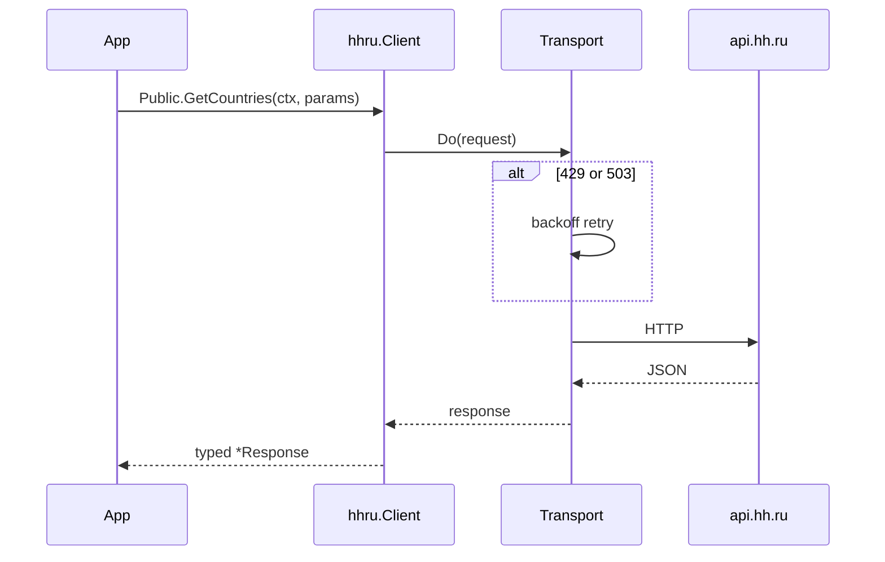

# Architecture

Pet-project Go SDK for the HeadHunter API. Commercial patterns: spec-first client, pluggable transport, OAuth token lifecycle.

## Layers

```text
examples/          Runnable demos (public APIs, OAuth flows)
client.go            Facade hhru.New — wires sub-clients
transport.go         HTTP transport: retries, rate limit, hooks
option.go            Functional options (TokenSource, RetryPolicy)
token_refresh.go     RefreshingTokenSource for long-lived services
api_error.go         Typed API errors from response body
gen/                 OpenAPI-generated clients (employer, applicant, public, app)
api/openapi.yml      Source spec (regenerate gen/ in CI)
```

## Request flow



## OAuth

1. **App token** — `client_credentials` for server-side public endpoints.
2. **User token** — authorization code flow; pass `TokenSource` into `hhru.New`.
3. **Refresh** — `NewRefreshingTokenSource` serializes refresh under mutex; safe for concurrent goroutines.

## Retry policy

Default retries on `429` and `503` with exponential backoff. Configure via `WithRetryPolicy`. Optional request-rate limiter prevents burst overload.

## Error handling

Non-2xx responses become `*APIError` with status, body snippet, and request id when present. Wrap transport errors with `%w` for `errors.Is` checks.

## CI

`go test ./...`, generation drift check, `golangci-lint` via composite action in `.github/workflows/ci.yml`.
